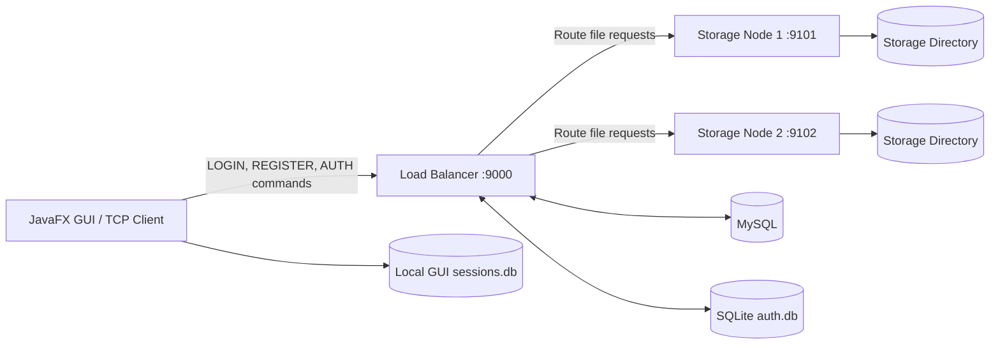

<h1 align="center">Cloud Server System</h1>

<p align="center">
  A distributed Java-based cloud storage system built around a TCP load balancer, multiple storage nodes, access control, metrics, and a JavaFX desktop client.
</p>

<p align="center">
  
  
  
  
  
</p>

---

## Overview

Cloud Server System is a distributed systems project that simulates a small cloud storage platform with a dedicated load balancer, two storage nodes, database-backed authentication and audit logging, and a JavaFX GUI client.

The project is designed around clear systems concepts rather than just CRUD functionality. It demonstrates:

- request routing through a central load balancer
- deterministic file placement across storage nodes
- token-based authentication
- ACL-based file access control
- health-aware dispatching
- metrics and latency tracking
- desktop client interaction over raw TCP sockets
- Docker-based deployment and a lightweight local VM mode

This repository is structured as a multi-module Maven project, with each core service separated into its own module.

---

## Key Features

### Core platform features
- Multi-module Java 17 architecture
- TCP-based request/response protocol
- Dedicated load balancer listening on port `9000`
- Two independent storage nodes listening on ports `9101` and `9102`
- JavaFX desktop GUI for login, registration, and file operations
- Docker Compose deployment for containerised execution

### Authentication and access control
- User registration and login
- Token-based sessions issued by the load balancer
- Session TTL of 6 hours
- Role model with `STANDARD` and `ADMIN`
- Access Control List (ACL) support for read/write permissions
- File sharing via the `SHARE` command
- Owner read/write permissions created automatically after a successful store

### File and storage features
- Store, load, list, and delete file operations
- Base64 transport for file content over TCP
- Deterministic filename-based routing to storage nodes
- Fallback lookup for `LOAD` and `DELETE` when the first node reports not found
- File locking per filename on storage nodes to reduce write/read conflicts
- Basic terminal-style commands on storage nodes such as `MKDIR`, `LS`, `TREE`, `CP`, `MV`, and `NANO`

### Reliability and observability
- Storage health checks using `PING`
- Request scheduling queue in the load balancer
- Selectable scheduling mode: `RR`, `FCFS`, `SJN`
- Request, command, node, and latency metrics
- Audit logging for authentication and file actions
- Separate timing visibility for queue wait, artificial delay, forwarding, and end-to-end server latency

---

## Architecture



### Component responsibilities

#### 1. Load Balancer
The load balancer is the centre of the system. It:

- accepts all client connections
- validates optional `AUTH <token>` wrappers
- handles registration and login
- enforces ACL rules before file operations are forwarded
- queues requests for dispatch
- selects storage nodes based on routing logic
- checks node health using `PING`
- records metrics and audit events

#### 2. Storage Nodes
Each storage node is a TCP file server. It:

- stores files on disk under a configured root directory
- processes file commands such as `STORE`, `LOAD`, `DELETE`, and `LIST`
- responds to health checks with `PONG`
- maintains simple per-node metrics
- uses per-file locks to reduce race conditions
- provides limited terminal-like commands for filesystem interaction

#### 3. Authentication / ACL Layer
Authentication and access control are implemented inside the load balancer through `AuthAclService`.

This service manages:

- user creation
- password verification
- session token generation and validation
- file ownership checks
- read/write permission checks
- file sharing records
- audit logging

It supports two backends:

- `SQLite` for local or VM-based execution
- `MySQL` for Docker deployment

#### 4. JavaFX GUI Client
The GUI client provides a desktop front end for:

- registering users
- logging in
- storing text content as files
- loading file content back into the editor
- listing files
- deleting files
- saving the latest session locally in SQLite

---

## Request Flow

A typical authenticated file request follows this path:

1. The GUI sends a command such as `AUTH <token> STORE notes.txt <base64>`.
2. The load balancer validates the token.
3. ACL and ownership rules are checked.
4. The request is added to the scheduler queue.
5. A storage node is selected using deterministic routing.
6. The load balancer applies any configured artificial delay.
7. The request is forwarded to the chosen storage node.
8. The storage node writes or reads the file from disk.
9. The response is returned to the load balancer.
10. The load balancer records metrics and audit entries.
11. The response is returned to the client.

---

## Routing and Scheduling Design

### Deterministic file routing
For `STORE`, `LOAD`, and `DELETE`, the load balancer hashes the filename so the same file key consistently maps to the same storage node.

This gives the project a simple but effective placement strategy:

- predictable file location
- no central lookup required to choose the primary node
- stable behaviour across repeated operations on the same file

### Fallback behaviour
For `LOAD` and `DELETE`, if the primary node returns a not-found response, the load balancer may retry on the other node.

This is useful when:

- files were previously placed differently
- testing created inconsistent state
- the expected node does not contain the file

### Scheduling algorithms
The load balancer exposes a runtime algorithm switch:

- `RR` — round-robin style behaviour for non-keyed operations
- `FCFS` — first come, first served based on enqueue time
- `SJN` — shortest job next using payload length as a proxy

The scheduler is backed by a `PriorityBlockingQueue`.

---

## Security Model

### Password handling
Passwords are not stored in plain text. The load balancer hashes them using:

- random salt generation
- SHA-256 digesting
- a stored format similar to `sha256$<salt>$<digest>`

### Sessions
After a successful login, the load balancer issues a UUID token. This token is required for authenticated file operations.

Important behaviour:

- tokens are stored in memory inside the load balancer
- token expiry is set to 6 hours
- restarting the load balancer invalidates active sessions

### Access control
The access model is ownership-based with shareable ACL rules.

- owners receive read/write access
- admins can bypass normal ownership restrictions
- users can share files with other users via `SHARE <filename> <targetUser> <R|W|RW>`
- `LOAD` checks read permission
- `STORE` and `DELETE` check write permission when the file already exists

### Filesystem safety
Storage nodes validate paths to reduce traversal attacks:

- filenames reject `..`, `/`, and `\`
- relative path commands are normalised
- resolved paths must remain inside the configured storage root

---

## Metrics and Monitoring

The project includes metrics at both the load balancer and storage levels.

### Load balancer metrics
The `STATS` command returns a compact snapshot including:

- total requests
- total errors
- per-command counts
- per-node counts
- average and 95th percentile server latency
- queue wait average and p95
- artificial delay average and p95
- forwarding average and p95

### Storage node metrics
Each storage node also exposes `STATS`, including:

- total requests
- ping count
- store count
- load count
- delete count
- error count

This makes the project useful not only as a storage system but also as a teaching example for observability and performance instrumentation.

---

## Tech Stack

| Layer | Technology |
|---|---|
| Language | Java 17 |
| Build system | Maven |
| Desktop client | JavaFX |
| Networking | Raw TCP sockets |
| Databases | MySQL 8 / SQLite |
| Containers | Docker / Docker Compose |
| Persistence | Filesystem + relational metadata |

---

## Project Structure

```text
cloud-server-system/
├── pom.xml                         # Parent Maven project
├── docker-compose.yml              # Multi-service container setup
├── README.md
├── mysql/
│   └── init.sql                   # MySQL schema initialisation
├── load-balancer/
│   ├── pom.xml
│   └── src/main/java/
│       ├── LoadBalancer.java      # Main server, scheduler, routing
│       ├── AuthAclService.java    # Auth, sessions, ACL, audit
│       ├── Metrics.java           # LB metrics collection
│       └── ClientHandler.java     # Auxiliary client handling class
├── storage1/
│   ├── pom.xml
│   └── src/main/java/
│       ├── Servers.java           # Storage node 1 entry point
│       ├── ClientHandler.java     # Storage command handling
│       └── MySqlStore.java        # MySQL metadata/audit helper
├── storage2/
│   ├── pom.xml
│   └── src/main/java/
│       ├── Servers.java           # Storage node 2 entry point
│       ├── ClientHandler.java     # Storage command handling
│       └── MySqlStore.java        # MySQL metadata/audit helper
├── gui-app/
│   ├── pom.xml
│   └── src/
│       ├── main/java/
│       │   ├── MainApp.java       # JavaFX launcher
│       │   ├── LoginController.java
│       │   ├── MainController.java
│       │   ├── TcpClient.java
│       │   └── SessionStore.java  # Local SQLite session history
│       └── main/resources/
│           ├── login.fxml
│           └── main.fxml
└── test.ps1                       # Example PowerShell test script
```

---

## Supported Commands

### Public commands handled by the load balancer

| Command | Description |
|---|---|
| `REGISTER <username> <password>` | Create a new standard user |
| `LOGIN <username> <password>` | Authenticate and receive a token |
| `AUTH <token> STORE <file> <base64>` | Store a file |
| `AUTH <token> LOAD <file>` | Load a file |
| `AUTH <token> DELETE <file>` | Delete a file |
| `AUTH <token> LIST` | List files |
| `AUTH <token> SHARE <file> <user> <R|W|RW>` | Share a file with another user |
| `STATS` | Show load balancer metrics |
| `ALGO RR` / `ALGO FCFS` / `ALGO SJN` | Change scheduling mode |

### Commands available on storage nodes

| Command | Description |
|---|---|
| `PING` | Health check |
| `HELLO` | Simple node greeting |
| `TIME` | Node local time |
| `STATS` | Node metrics |
| `STORE <file> <base64>` | Store a file |
| `LOAD <file>` | Load a file |
| `DELETE <file>` | Delete a file |
| `LIST` | List files |
| `MKDIR <dir>` | Create directory |
| `LS [dir]` | List directory contents |
| `TREE [dir]` | Print directory tree |
| `CP <src> <dst>` | Copy file |
| `MV <src> <dst>` | Move file |
| `NANO <file> <base64>` | Write content into a file |
| `WHOAMI` | Minimal identity response |
| `PS` | Minimal process response |

---

## Database Schema

The MySQL schema in `mysql/init.sql` defines four main tables:

### `users`
Stores registered users, password hashes, roles, and timestamps.

### `files`
Stores file metadata such as:

- owner
- filename
- storage node
- size
- creation time

### `acl`
Stores file-sharing permissions:

- owner
- file
- grantee
- read permission
- write permission

### `audit_log`
Stores security and activity events such as:

- registration
- login
- store
- load
- delete
- share

In local SQLite mode, the load balancer automatically creates a simplified equivalent schema on startup.

---

## Getting Started

## Prerequisites

You will typically need:

- Java 17
- Maven
- Docker and Docker Compose for container mode
- JavaFX-compatible environment for the desktop client

---

## Running with Docker Compose

This is the most complete deployment path because it includes MySQL and both storage nodes.

### 1. Build and start services

```bash
docker compose up --build
```

This starts:

- `load-balancer` on `9000`
- `storage1` on `9101`
- `storage2` on `9102`
- `mysql` on `3306`
- stub containers for `partitioner` and `host-manager`

### 2. Open another terminal and test the system

Example using a TCP client such as `nc`:

```bash
printf "REGISTER demo1 password123\n" | nc localhost 9000
printf "LOGIN demo1 password123\n" | nc localhost 9000
printf "STATS\n" | nc localhost 9000
```

### 3. Run the GUI client

The GUI is not started by `docker-compose.yml`, so run it separately from the host or your IDE.

Set the host if needed:

```bash
export LB_HOST=localhost
export LB_PORT=9000
mvn -pl gui-app javafx:run
```

---

## Running in Local / VM Mode

The codebase also supports a lightweight mode where authentication uses SQLite instead of MySQL.

### 1. Build the project

```bash
mvn clean package
```

### 2. Start storage node 1

```bash
java -jar storage1/target/storage1-1.0-SNAPSHOT.jar
```

### 3. Start storage node 2

```bash
java -jar storage2/target/storage2-1.0-SNAPSHOT.jar
```

### 4. Start the load balancer in SQLite mode

```bash
AUTH_DB=sqlite MIN_DELAY_SEC=0 MAX_DELAY_SEC=0 \
java -jar load-balancer/target/load-balancer-1.0-SNAPSHOT-all.jar
```

### 5. Run the GUI

```bash
LB_HOST=localhost LB_PORT=9000 mvn -pl gui-app javafx:run
```

---

## Example Workflow

### Register a user

```text
REGISTER alice mypassword
```

Expected response:

```text
OK
```

### Login

```text
LOGIN alice mypassword
```

Expected response:

```text
OK TOKEN <uuid> ROLE STANDARD
```

### Store a file

`hello world` in Base64 is:

```text
aGVsbG8gd29ybGQ=
```

Send:

```text
AUTH <token> STORE notes.txt aGVsbG8gd29ybGQ=
```

### Load a file

```text
AUTH <token> LOAD notes.txt
```

### List files

```text
AUTH <token> LIST
```

### Delete a file

```text
AUTH <token> DELETE notes.txt
```

### Share a file

```text
AUTH <token> SHARE notes.txt bob R
```

---

## Environment Variables

### Load balancer

| Variable | Purpose | Default |
|---|---|---|
| `AUTH_DB` | Auth backend: `sqlite` or `mysql` | `sqlite` |
| `DB_HOST` | MySQL host | `mysql` |
| `DB_PORT` | MySQL port | `3306` |
| `DB_NAME` | MySQL database name | `cloud` |
| `DB_USER` | MySQL username | `root` |
| `DB_PASS` | MySQL password | `root` |
| `SQLITE_PATH` | SQLite DB path in local mode | `auth.db` |
| `MIN_DELAY_SEC` | Minimum artificial LB delay for file ops | `30` |
| `MAX_DELAY_SEC` | Maximum artificial LB delay for file ops | `90` |

### Storage nodes

| Variable | Purpose | Default |
|---|---|---|
| `STORE_DIR` | Root directory used for file persistence | `./data` |

### GUI client

| Variable | Purpose | Default |
|---|---|---|
| `LB_HOST` | Load balancer host | `localhost` |
| `LB_PORT` | Load balancer port | `9000` |

---

## Notes for Demonstration or Coursework Use

This repository is especially useful for demonstrating distributed systems concepts such as:

- separation of concerns between routing, storage, and client layers
- token-based security in a socket application
- scheduler design using priority queues
- deterministic request routing
- node health checking
- latency instrumentation
- hybrid persistence using files plus relational metadata

It is also a good project to discuss in a viva, demo, or technical presentation because the logic is visible across clearly separated services.

---

## Current Limitations

A strong README should be honest about what is implemented and what is still simplified. Based on the current codebase, these are the main limitations:

- sessions are stored in memory inside the load balancer, so restarting it invalidates all tokens
- there is no encryption or TLS on the TCP protocol
- storage nodes do not replicate files between each other
- the Docker compose file includes `partitioner` and `host-manager` as placeholders rather than full services
- the GUI currently focuses on registration, login, list, store, load, and delete; it does not expose every backend command such as `SHARE` or `ALGO`
- the storage node MySQL helper currently uses a hardcoded demo owner in some metadata logging paths, so ownership metadata should be treated as a simplification rather than a production-grade source of truth
- artificial request delays are enabled by default in Docker mode for experimentation and may make the system feel slow unless tuned down

These limitations do not reduce the value of the project, but documenting them makes the repository look more credible and technically mature.

---

## Potential Improvements

Recommended next steps for future development:

- persistent shared session storage instead of in-memory tokens
- file replication across storage nodes
- stronger password hashing such as Argon2 or bcrypt
- TLS or encrypted transport between client and services
- richer GUI support for sharing, metrics, and admin actions
- full metadata consistency between storage nodes and the ACL database
- service discovery instead of hardcoded node definitions
- automated integration tests for routing, failover, and permissions
- real partitioning and host management services

---


## License

University project All rights reserved.

---

## Author

Replace this section with your preferred GitHub name, full name, student profile, or project ownership details.

```text
Author: Terkaudoon Abbo
Project: Cloud Server System
```

